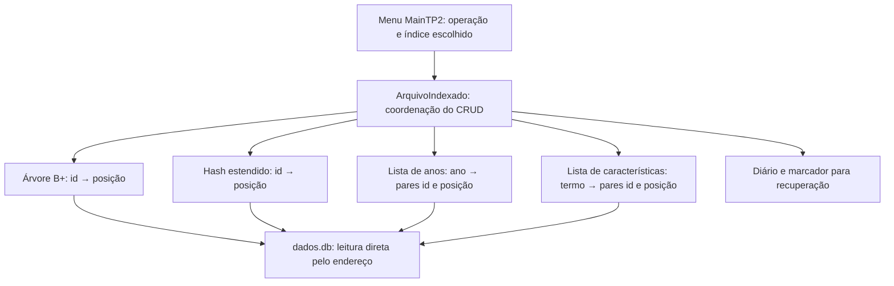

# Decisões de implementação — TP2 de AEDS III

**Tema:** cadastro de carros. **Grupo 15:** Gabriel Benicio Fonseca e Rhayner Martins.

O TP2 aproveita a entidade e o formato de arquivo do TP1. A mudança principal está no caminho usado para encontrar um carro: o programa consulta um índice, recebe o endereço do registro e vai diretamente a esse ponto do arquivo de dados.

## 1. Como foram interpretadas as instruções

As instruções desta entrega exigem indexação na etapa 2, com buckets de **2%** da base inicial. O sistema usa `--percentual 2` como padrão. Outros percentuais permanecem disponíveis para experimentos, mas não devem ser usados para apresentar conformidade com este enunciado. Não foi informado prazo no texto recebido.

A árvore escolhida é a **B+**. Sua ordem padrão é 16 e pode ser alterada por `--ordem`. Neste projeto, ordem significa **máximo de filhos de uma página interna**; portanto, uma página tem no máximo `ordem - 1` chaves. A interface aceita ordens de 3 a 1024.

Os quatro índices lógicos são uma árvore B+, um hash estendido, uma lista invertida por ano e uma lista invertida por característica. O hash usa dois arquivos físicos, um para o diretório e outro para os buckets.

## 2. Organização do programa



| Arquivo em `data/tp2/` | Conteúdo |
|---|---|
| `dados.db` | Cabeçalho com último ID e registros de carros com lápide e tamanho. |
| `arvore.bmais` | Cabeçalho, páginas internas, folhas e páginas livres da B+. |
| `hash.diretorio` | Profundidade global e referências aos buckets. |
| `hash.buckets` | Páginas com profundidade local e pares de ID e endereço. |
| `anos.lista` | Histórico persistente dos postings por ano. |
| `caracteristicas.lista` | Histórico persistente dos postings por característica. |
| `config.properties` | Ordem, percentual, tamanho inicial da base e metadados de coerência. |
| `transacao.bin` e `indices.pendentes` | Arquivos auxiliares usados enquanto há uma alteração a concluir ou recuperar. |

Na primeira execução na pasta padrão, se já existir `data/dados.db`, o menu copia esse arquivo do TP1 para `data/tp2/dados.db`. Também é possível importar `data/base.csv` pelo menu. O CSV contém o recorte de 100.000 anúncios documentado no TP1.

## 3. O que significa a posição de um registro

O arquivo mantém este formato:

```text
Cabeçalho: [ultimoId: int]
Registro:  [lapide: byte][tamanho: int][carro serializado: byte[]]
```

A posição gravada nos índices é um `long` com o deslocamento, em bytes, até a **lápide do registro**. O primeiro registro pode começar no endereço 4, logo depois do cabeçalho. O ID identifica o carro; a posição informa onde seus bytes estão naquele momento. Um mesmo ID pode receber outra posição depois de uma atualização.

A leitura por endereço também confere os limites do arquivo, a lápide, o tamanho e o ID encontrado. Assim, um ponteiro incorreto não é aceito como se apontasse para o carro solicitado.

## 4. Por que usar árvore B+

O ID é único, pequeno e estável, o que o torna adequado à chave do índice. Na B+, os nós internos orientam a busca e as folhas guardam os pares `(id, posição)`. Todas as folhas ficam na mesma profundidade e são encadeadas, permitindo listar as entradas em ordem crescente.

Essa organização é útil em arquivos porque uma página reúne várias chaves. A busca desce da raiz até uma folha, lendo as páginas necessárias. Dentro de cada página, a escolha da chave ou do filho usa busca binária. A implementação lê as páginas da árvore do disco; não reconstrói uma árvore inteira em memória a cada consulta.

As inserções dividem páginas que excedem a capacidade. Se a divisão chega à raiz, uma nova raiz é criada. As remoções tratam falta de ocupação com empréstimo de um irmão ou fusão de páginas. Quando necessário, a altura da raiz diminui. Páginas liberadas entram em uma lista de espaços reutilizáveis.

Cada separador interno guarda o menor ID do filho à sua direita. Após alterações, esses separadores também precisam ser corrigidos. A remoção é incremental: o programa não apaga e refaz a árvore inteira para excluir um carro.

O cabeçalho da árvore ocupa 48 bytes. As páginas têm tamanho fixo de `20 × ordem + 1` bytes, ou 321 bytes na ordem 16. O formato reserva os mesmos campos para os tipos de página, mesmo quando alguns ficam sem uso; essa regularidade facilita localizar e interpretar páginas, com algum desperdício de espaço. O valor 16 foi escolhido como configuração prática e fácil de demonstrar, sem alegar que seja a ordem ótima para qualquer disco ou carga.

A validação confere ordenação, ocupação, separadores, profundidade das folhas, encadeamento, ciclos e correspondência entre páginas ativas e livres.

## 5. Como funciona o hash estendido

O hash também indexa o ID. Isso permite comparar dois caminhos de acesso à mesma chave: árvore e hash devolvem o endereço do mesmo carro.

A função exigida é:

```text
h(id) = id mod 2^p
```

Para IDs positivos, a expressão `id & (2^p - 1)` usada no código produz exatamente esse resto. O programa começa com profundidade global zero, uma referência no diretório e um bucket. Cada bucket possui sua própria profundidade local.

Quando o bucket está cheio, ele é dividido usando mais um bit. Se sua profundidade local já era igual à global, o diretório dobra antes da redistribuição. Caso contrário, basta ajustar as referências que apontavam para aquele bucket. Uma mesma página pode, portanto, ser referenciada por mais de uma entrada do diretório.

A capacidade é calculada uma vez sobre o tamanho inicial da carga:

```text
X = max(1, ceil(N_inicial × percentual / 100))
```

| Carga inicial | Percentual | Capacidade de cada bucket |
|---:|---:|---:|
| 100.000 carros | 2% | 2.000 pares |
| 30 carros | 2% | 1 par |

O arredondamento para cima resolve capacidades fracionárias; o mínimo 1 permite começar com uma base pequena ou vazia. O tamanho inicial é salvo na configuração. Criar ou excluir carros depois da carga não recalcula X. Uma nova importação define uma nova base inicial.

O diretório fica em memória e também é persistido. Os buckets são lidos do arquivo. Cada página de bucket ocupa `8 + 12 × X` bytes: dois inteiros de controle e X pares de `int` com `long`. Uma consulta acessa o bucket indicado e procura o ID entre seus pares ocupados. Essa procura interna é linear no número de pares do bucket, portanto não se afirma que todo o trabalho de uma busca seja sempre constante.

Ao remover, o último par ocupado preenche o espaço do par retirado. Os buckets não são fundidos e o diretório não diminui. Isso mantém a correção, mas pode deixar capacidade ociosa após muitas exclusões. A profundidade global tem limite 20, equivalente a até 1.048.576 referências. Colisões que não possam ser resolvidas nesse limite geram um erro explícito; o índice não cresce indefinidamente.

## 6. Por que ano e características nas listas invertidas

O ano aparece em muitos carros e é útil para filtrar o catálogo. O campo de características é uma lista com valores como `gas`, `automatic` e `8 cylinders`. Indexar esses dois campos permite tanto uma pesquisa simples quanto uma seleção mais específica: carros de determinado ano com determinada característica.

Cada valor completo de característica é um termo. `8 cylinders` é indexado como uma expressão inteira, e não como duas palavras separadas. A normalização remove acentos, converte para minúsculas e uniformiza os espaços. Ela permite consultar `GAS` como `gas`, mas não traduz termos nem procura trechos de palavras.

Cada posting contém `(id, posição)`. Guardar o endereço junto com o ID permite ler diretamente os carros selecionados, sem consultar obrigatoriamente a árvore ou o hash depois da lista. Características repetidas no mesmo carro são tratadas uma só vez, e adicionar novamente o mesmo ID a um termo atualiza sua posição em vez de duplicá-lo.

O dicionário e os postings das listas ficam em memória. Cada arquivo mantém um histórico de eventos de adição e remoção, carregado quando o índice é aberto. Os eventos possuem tamanho e CRC32, que ajudam a detectar truncamento e corrupção. Na exclusão do último posting de um termo, o termo também sai do dicionário.

Essa escolha simplifica as consultas e evita regravar todas as listas a cada alteração. Em contrapartida, o consumo de memória cresce com a quantidade de postings e a abertura precisa reler o histórico. A classe oferece `compactar()`, que grava somente os postings atuais e substitui o arquivo por uma troca atômica. A compactação das listas está disponível na API; não há uma opção própria para ela no menu.

### Pesquisa usando as duas listas

Quando ano e característica são preenchidos, o resultado é a interseção, isto é, uma condição **E**. O exemplo abaixo é didático:

```text
ano = 2014:  IDs {1, 7, 9}
termo = gas: IDs {1, 4, 9}
resultado:  IDs {1, 9}
```

A implementação também exige que os endereços associados coincidam. Se apenas um filtro é preenchido, usa sua lista correspondente. O menu mostra até 20 carros e informa o total encontrado; esse limite é apenas de exibição, pois a consulta atual materializa todos os resultados em memória.

## 7. Como o índice participa de cada operação

Antes de criar, consultar, atualizar ou excluir, o menu pergunta qual método será usado. Escolher um método define o caminho de localização ou confirmação daquela operação. **Toda alteração mantém os quatro índices atualizados**, inclusive os que não foram escolhidos.

| Operação | Participação do índice | Alteração dos arquivos |
|---|---|---|
| Criar | Confirma o novo ID pelo método escolhido. No caso da lista, usa o ano do carro criado. | Gera o próximo ID, acrescenta o registro e insere suas entradas nos quatro índices. |
| Consultar | Árvore ou hash recebe o ID; lista recebe ano e/ou característica e seleciona o ID entre os candidatos. | Lê diretamente o endereço encontrado. |
| Atualizar | Localiza o registro antigo pelo método e filtros escolhidos. | Atualiza o conteúdo e substitui as entradas antigas em todos os índices. |
| Excluir | Localiza o registro pelo método escolhido. | Marca lápide e remove suas entradas de todos os índices. |

No Create não existe um registro anterior a localizar. Por isso, o ID vem do cabeçalho e a escolha do índice é usada para conferir a inserção. Essa diferença é mostrada explicitamente no código e na execução.

Ao atualizar por lista invertida, os filtros usados para encontrar o carro são os valores **anteriores** à edição. Se o ano ou a característica mudou, a consulta seguinte deve usar os novos valores. Consultar pelo filtro antigo pode corretamente não encontrar mais aquele carro.

### Atualização com e sem mudança de endereço

Se a nova serialização possui exatamente o mesmo número de bytes, o conteúdo é sobrescrito no endereço original. Alterar apenas o ano é um exemplo útil: ele continua ocupando quatro bytes.

Se o tamanho muda, inclusive para um tamanho menor, o novo registro é acrescentado ao fim do arquivo e o antigo recebe lápide. O ID é preservado e todos os índices passam a guardar o endereço novo. O sistema não reutiliza espaços de registros excluídos no arquivo de dados; a reutilização implementada na B+ refere-se às páginas do índice.

## 8. Coerência, recuperação e auditoria

`ArquivoIndexado` coordena as alterações. Antes de modificar um registro, escreve um diário com o tamanho anterior do arquivo, o último ID e, quando aplicável, os bytes anteriores do registro. Um marcador informa que os índices estão em atualização. Uma falha durante o CRUD pode ser desfeita com esse diário, seguida de reconstrução dos índices a partir dos registros ativos.

Na abertura, o programa considera o diário, o marcador, a presença dos índices, os parâmetros e os metadados do banco. A alteração da ordem ou do percentual solicita reconstrução. Durante o uso, mudanças detectadas no tamanho ou na data de modificação do banco também provocam reconstrução. Essa verificação por metadados não substitui uma auditoria nem garante detectar toda adulteração externa possível.

O arquivo de dados recebe uma trava para impedir duas instâncias do aplicativo de alterarem a mesma base ao mesmo tempo. A solução é de uso local por um processo, e não um servidor com transações concorrentes.

A importação primeiro valida e escreve o CSV em um temporário, e salva a base anterior em `antes-da-carga.db` antes da substituição. O marcador `carga.pendente` guarda os metadados anteriores e permite restaurar o backup e o tamanho inicial quando uma carga não é confirmada, inclusive se o cabeçalho ficar truncado. O CRUD sincroniza os quatro índices antes de remover seu diário. Essa recuperação foi testada com interrupções simuladas e erros reais de gravação de metadados; não equivale a uma garantia para qualquer falha de hardware.

A opção **Auditar tudo** faz uma varredura dos registros ativos, constrói o resultado esperado e compara IDs, endereços, anos e características com os quatro índices. Também executa as validações internas de cada estrutura. A auditoria e a reconstrução precisam ler o banco sequencialmente; a consulta normal pelo ID usa o índice escolhido.

Os mecanismos de recuperação e validação aumentam a robustez, mas não equivalem às garantias de um SGBD de produção diante de qualquer falha de hardware ou sistema de arquivos.

## 9. Verificação e reprodução

Na raiz do projeto, com JDK 11 ou superior:

```sh
./compilar.sh
./testar.sh
java -cp out TesteTP2 --base-100k
java -cp out DemonstracaoTP2
```

No Windows, os equivalentes são `compilar.bat`, `testar.bat` e os mesmos comandos `java`. A compilação precisa usar UTF-8 para preservar os textos em português.

Os testes separados das estruturas são `TesteArvoreBMais`, `TesteHashEstendido` e `TesteListaInvertida`. Eles permitem verificar divisão e remoção de páginas, crescimento do hash, mudanças de endereço, persistência e rejeição de arquivos inválidos. O teste integrado deve ser consultado para observar a coerência entre os quatro índices e o banco após cada cenário.

Para medir a base real, execute o teste de 100.000 carros e registre a saída obtida no computador utilizado. Tempos de execução são resultados daquele ambiente, não uma promessa de desempenho. O roteiro de vídeo orienta mostrar as evidências reais; este documento descreve os critérios e não substitui o log de execução.

## 10. Limites e possíveis extensões

As principais limitações são o diretório do hash e as listas invertidas em memória, a materialização dos resultados de pesquisa, a ausência de fusão de buckets e o crescimento do histórico das listas até sua compactação. Também não existe consulta por intervalo de IDs no menu, embora as folhas encadeadas da B+ sejam uma base para implementá-la.

Uma evolução possível seria paginar postings das listas em disco e carregar apenas os trechos consultados. Outra seria fundir buckets após exclusões e oferecer paginação dos resultados da pesquisa. Essas extensões não são necessárias para explicar o funcionamento entregue e não devem ser apresentadas como funcionalidades já implementadas.

## Revisão de validação da entrada

A importação reconhece o cabeçalho pelos quatro campos esperados, sem confundir a palavra “caracteristicas” no nome de um carro com um cabeçalho. Aceita BOM UTF-8 e linhas vazias antes do cabeçalho. O leitor CSV rejeita aspas não fechadas ou caracteres indevidos após o fechamento; cada registro deve ocupar uma linha.

O arquivo temporário de carga tem nome exclusivo, para não truncar o CSV informado pelo usuário. Erros de leitura ou validação deixam o banco e os índices anteriores preservados. Um arquivo de dados zerado com configuração ou índices existentes é tratado como truncamento e gera erro; o sistema não apaga os índices para fingir uma nova base vazia.

Esses casos estão em `TesteRevisaoTP2`, juntamente com o teste de que o prompt do menu aparece antes de receber entrada. Consulte `REVISAO_FINAL.md` para o resultado da revisão e os limites da verificação.
